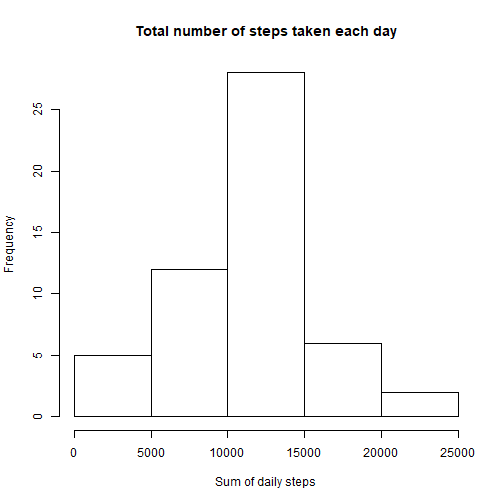
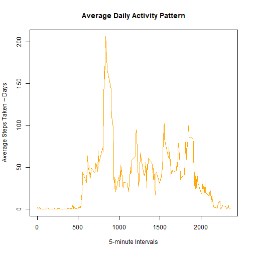
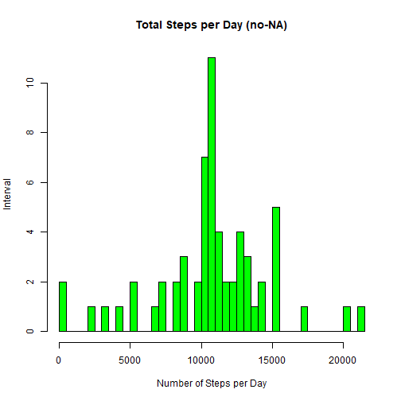
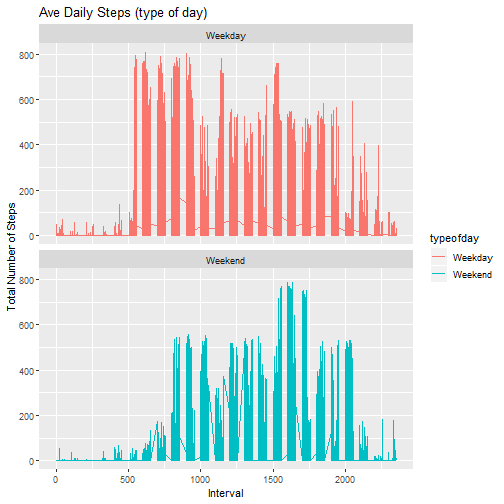

##This is the markdown file for the PA1 assignment

Show any code that is needed to

1. Load the data (i.e. \color{red}{\verb|read.csv()|}read.csv())
2. Process/transform the data (if necessary) into a format suitable for your analysis


```r
setwd("C:/Users/sadhamdh/Documents/R")
rawdata<-read.csv("activity.csv")
```

For this part of the assignment, you can ignore the missing values in the dataset.

1. Calculate the total number of steps taken per day
2. If you do not understand the difference between a histogram and a barplot, research the difference between them. Make a histogram of the total number of steps taken each day
3. Calculate and report the mean and median of the total number of steps taken per day


```r
dailySteps<-tapply(rawdata$steps,rawdata$date,sum)
hist(dailySteps, xlab="Sum of daily steps", main="Total number of steps taken each day")
```



```r
mean(dailySteps,na.rm = TRUE)
```

```
## [1] 10766.19
```

```r
median(dailySteps,na.rm = TRUE)
```

```
## [1] 10765
```

What is the average daily activity pattern?
1. Make a time series plot (i.e. \color{red}{\verb|type = "l"|}type="l") of the 5-minute interval (x-axis) and the average number of steps taken, averaged across all days (y-axis)
2. Which 5-minute interval, on average across all the days in the dataset, contains the maximum number of steps?


```r
## five minute average using steps to interval - FUN = mean instead of sum
fivemin <- aggregate(steps ~ interval, data = rawdata, FUN = mean, na.rm = TRUE)
## line chart
plot(x = fivemin$interval, 
    y = fivemin$steps, 
    type = "l", 
    col = "orange",
    xlab = "5-minute Intervals",
    ylab = "Average Steps Taken ~ Days",
    main = "Average Daily Activity Pattern")
```



```r
maxsteps <- fivemin$interval[which.max(fivemin$steps)]
maxsteps
```

```
## [1] 835
```

Imputing missing values
Note that there are a number of days/intervals where there are missing values (coded as \color{red}{\verb|NA|}NA). The presence of missing days may introduce bias into some calculations or summaries of the data.

1. Calculate and report the total number of missing values in the dataset (i.e. the total number of rows with \color{red}{\verb|NA|}NAs)
2. Devise a strategy for filling in all of the missing values in the dataset. The strategy does not need to be sophisticated. For example, you could use the mean/median for that day, or the mean for that 5-minute interval, etc.
3. Create a new dataset that is equal to the original dataset but with the missing data filled in.
4. Make a histogram of the total number of steps taken each day and Calculate and report the mean and median total number of steps taken per day. Do these values differ from the estimates from the first part of the assignment? What is the impact of imputing missing data on the estimates of the total daily number of steps?


```r
## sum of all the NA in data = activity
impute <- sum(is.na(rawdata$steps))
impute
```

```
## [1] 2304
```

```r
activity <- rawdata
nas <- is.na(activity$steps)
avg_interval <- tapply(activity$steps, activity$interval, mean, na.rm=TRUE, simplify = TRUE)
activity$steps[nas] <- avg_interval[as.character(activity$interval[nas])]

## Check for no-NA
sum(is.na(activity))
```

```
## [1] 0
```

```r
## Similar analysis without NAs now
totalstepsperday <- aggregate(steps ~ date, data = activity, FUN = sum, na.rm = TRUE)

## Histogram without the NA values
hist(totalstepsperday$steps, 
    main = "Total Steps per Day (no-NA)", 
    xlab = "Number of Steps per Day", 
    ylab = "Interval",
    col="green",
    breaks=50)
```



```r
## What is the impact of imputing data?
summary(dailySteps)
```

```
##    Min. 1st Qu.  Median    Mean 3rd Qu.    Max.    NA's 
##      41    8841   10765   10766   13294   21194       8
```

```r
summary(totalstepsperday)
```

```
##          date        steps      
##  2012-10-01: 1   Min.   :   41  
##  2012-10-02: 1   1st Qu.: 9819  
##  2012-10-03: 1   Median :10766  
##  2012-10-04: 1   Mean   :10766  
##  2012-10-05: 1   3rd Qu.:12811  
##  2012-10-06: 1   Max.   :21194  
##  (Other)   :55
```
Are there differences in activity patterns between weekdays and weekends?
For this part the \color{red}{\verb|weekdays()|}weekdays() function may be of some help here. Use the dataset with the filled-in missing values for this part.

1. Create a new factor variable in the dataset with two levels – “weekday” and “weekend” indicating whether a given date is a weekday or weekend day.
2. Make a panel plot containing a time series plot (i.e. \color{red}{\verb|type = "l"|}type="l") of the 5-minute interval (x-axis) and the average number of steps taken, averaged across all weekday days or weekend days (y-axis). See the README file in the GitHub repository to see an example of what this plot should look like using simulated data.


```r
library(dplyr)
```

```
## 
## Attaching package: 'dplyr'
```

```
## The following objects are masked from 'package:stats':
## 
##     filter, lag
```

```
## The following objects are masked from 'package:base':
## 
##     intersect, setdiff, setequal, union
```

```r
library(ggplot2)
activity$date <- as.Date(activity$date, "%Y-%m-%d")
## Add the new weekend/weekday field
activity<- activity%>% mutate(typeofday= ifelse(weekdays(activity$date)=="Saturday" | weekdays(activity$date)=="Sunday", "Weekend", "Weekday"))
head(activity)
```

```
##       steps       date interval typeofday
## 1 1.7169811 2012-10-01        0   Weekday
## 2 0.3396226 2012-10-01        5   Weekday
## 3 0.1320755 2012-10-01       10   Weekday
## 4 0.1509434 2012-10-01       15   Weekday
## 5 0.0754717 2012-10-01       20   Weekday
## 6 2.0943396 2012-10-01       25   Weekday
```

```r
## Time to plot - Line chart
fivemin2<- aggregate(steps ~ interval, data = activity, FUN = mean, na.rm = TRUE)
head(fivemin2)
```

```
##   interval     steps
## 1        0 1.7169811
## 2        5 0.3396226
## 3       10 0.1320755
## 4       15 0.1509434
## 5       20 0.0754717
## 6       25 2.0943396
```

```r
ggplot(activity, aes(x =interval , y=steps, color=typeofday)) +
       geom_line() +
       labs(title = "Ave Daily Steps (type of day)", x = "Interval", y = "Total Number of Steps") +
       facet_wrap(~ typeofday, ncol = 1, nrow=2)
```


